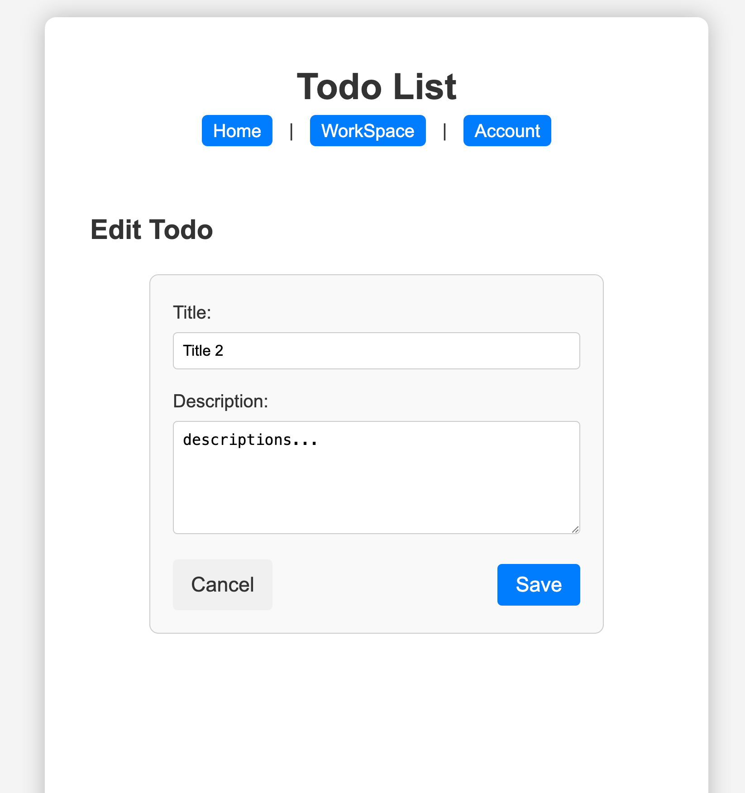

# Flask-MongoDB Web App

## App Title
Todo List

## Description
This is a simple todo list web app. It allows users to create, read, update, and delete todo items. 
Also, users can log in and log out to manage their todo lists.
The app is deployed on the NYU CS Department's web server and MongoDB server.

## Link

[https://i6.cims.nyu.edu/~yw4822/7-web-app-Yao0510/flask.cgi](https://i6.cims.nyu.edu/~yw4822/7-web-app-Yao0510/flask.cgi)

## Collaborators

This app is developed by myself.

## Functionality

- Home page: 
  - Display the welcome message.
  - Provide the login button.
- Login page:
  - Allow users to log in with their username and password.
  - Provide the register button for new users.
- Todo list page:
  - Display the user's todo list.
  - Provide the add, edit, and delete buttons for each todo item.
  - Users can add a new todo item by clicking the add button.
- Edit todo page:
  - Allow users to edit the todo item.
  - Provide the save and cancel buttons.
- Proper error handling:
  - Display the error message when the user enters the wrong username or password.
  - Display the error message when the user enters the empty todo item.
  - And more...

## Few Screen Shots
- Home:
  
- Login:
  
- Todo Lists:
  
- Edit todo:
  
